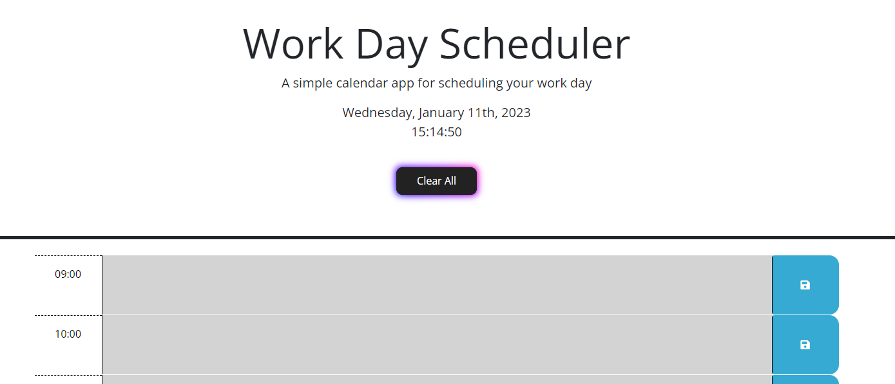

# Work Day Scheduler
 
## Description
The work day scheduler allows anyone to keep track of their tasks on a day to day basis by having the ability to place their tasks in the appropriate time slot.
 
## How it Works
- Start by choosing which time slot you would like to add text to.
- Next begin typing whatever you would like into the textbox in the time slot of your choosing.
- When completed, click the blue save button icon to the right of the textbox to save your event.
- Proceed to do the same until you have your day planned out.
- The text will be saved even if the page is closed and reopened.
- Use the Clear All button at the top to clear all the text from each textbox.
## Website Showcase
### <ins>[Work Day Planner](https://tiomeko.github.io/day-planner/)</ins>
 
 
 
